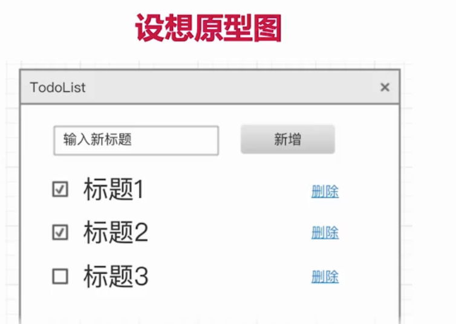
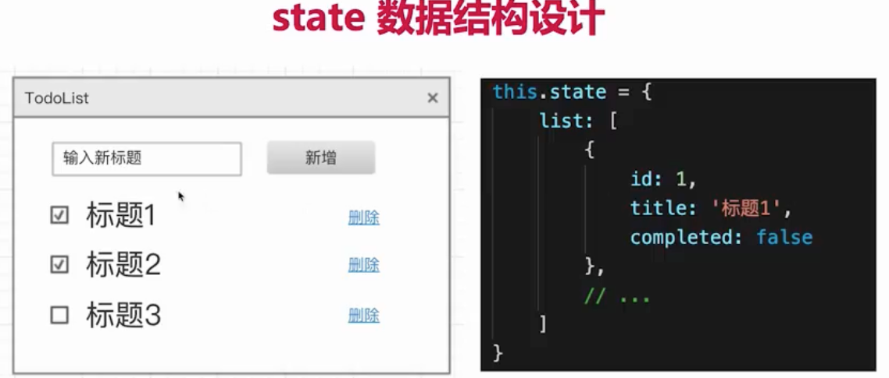
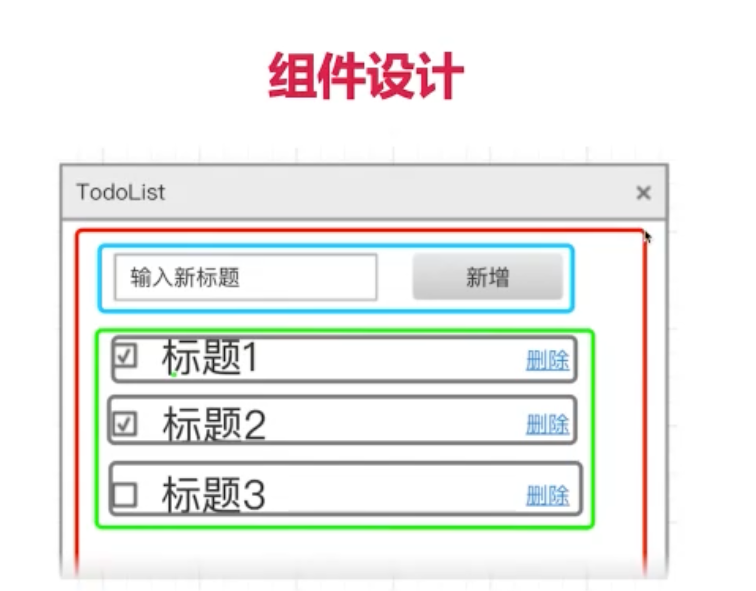

1. 框架 的 使用
2. 独立负责项目？

# 组件设计
> 设计一个todolist
> 设计一个购物车

## 1. 设想原型图

## 2. state 数据结构设计
    1. 用数据描述所有的内容
    2. 数据要结构化、语义化
    3. 数据要可扩展，以便于增加新功能

【注意要有id】

## 3. 组件设计
 从功能上拆分层次设计
 尽量让组件原子化

 要分：容器组件（只管理数据） 和 ui 组件（只显示视图）
 
 ui组件只管显示和交互
 容器组件主要接受事件

数据结构设计
1. 用户数据描述所有的内容
2. 数据要结构化
3. 数据要可扩展
组件设计
1. 从功能上拆分层次
2. 尽量让组件原子化
3. 容器化 + ui组件

# 案例 Vue 实现购物车

1. 设想原型图
2. 数据结构设计
    用数据表达所有内容
    数据可扩展
    数据要结构化

3. 组件设计
    单一职责
    容器组件 + ui组件
    从功能上拆分